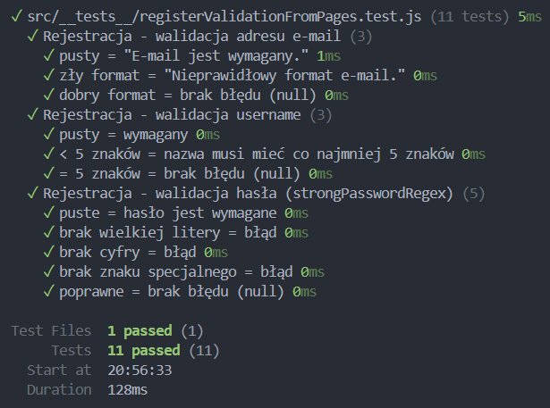
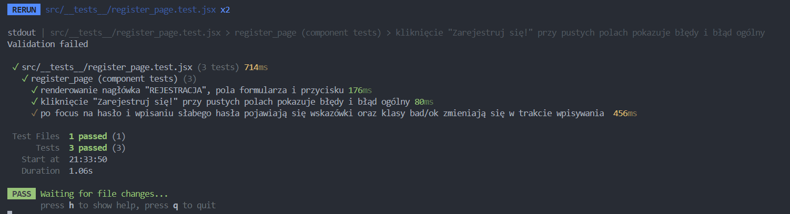
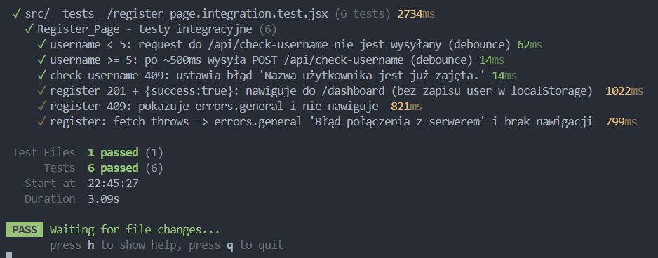
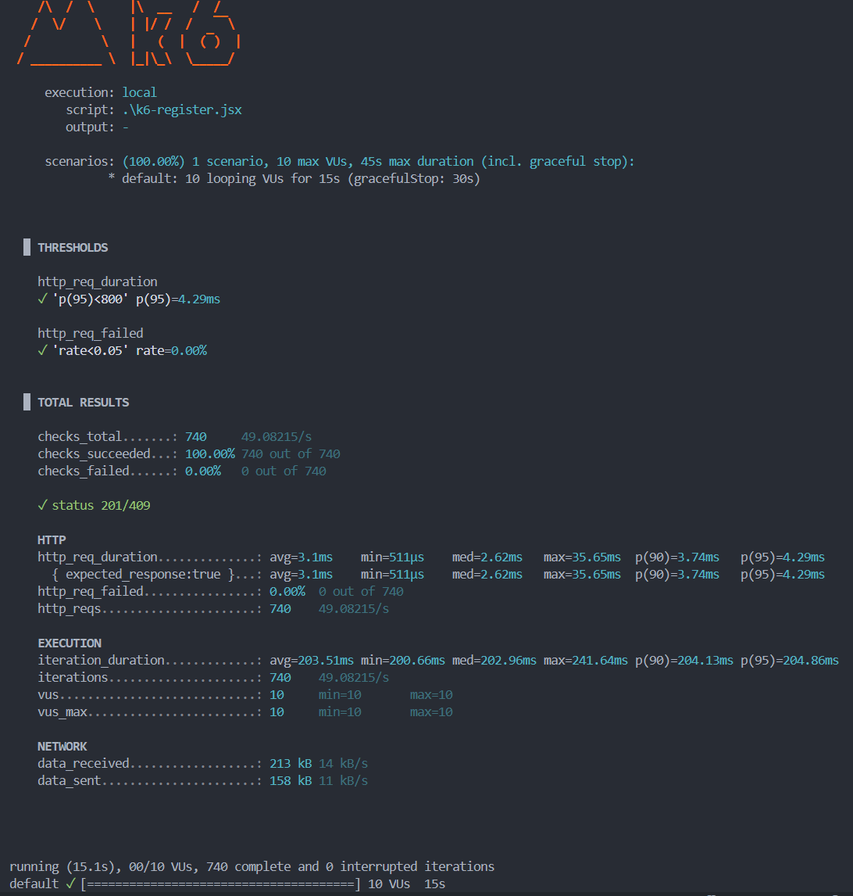
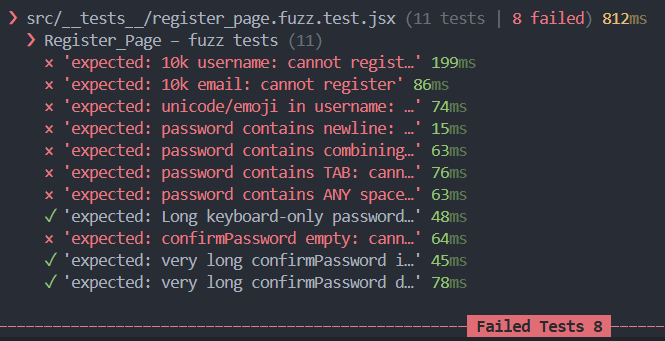

# Testowanie aplikacji Temple of Gains
Przy testowaniu skupimy się na stronie register_page.jsx.

## Wymagania projektowe dotyczące testowania:
- Testy jednostkowe
- Testy komponentów
- Testy wydajności
- Fuzz testing (fuzzing)
- Testy akceptacyjne UAT (wykorzystujące UI).

## Przebieg testów
### 1. Testy jednostkowe i testy komponentów
W naszych testach skorzystamy z vitest. Podręcznik użytkowania znajduje się na stronie: [vitest.dev](https://vitest.dev/guide/)

W katalogu projektu instalujemy zależności:
```bash
npm i -D vitest jsdom @testing-library/react @testing-library/jest-dom @testing-library/user-event
```
W `package-json` dopisujemy:
```bash
    "test": "vitest",
    "test:ui": "vitest --ui",
    "test:run": "vitest run",
    "test:coverage": "vitest run --coverage"
```
W vite.congif.js po ustawieniach serwera:
```bash
test: {
    environment: "jsdom",
    setupFiles: "./src/setupTests.js",
    globals: true
}
```

W folderze `src` tworzymy plik setupTest.js i importujemy bibliotekę:
```bash
import '@testing-library/jest-dom';
```
Następnie tworzymy w `src` folder `tests` i pierwszy test, aby sprawdzić poprawność działania:
```bash
import { describe, it, expect } from "vitest";

describe("smoke", () => {
  it("works", () => {
    expect(1 + 1).toBe(2);
  });
});
```
Tworzymy folder `utils`, w którym będziemy wyciągać funkcje do testów. Walidacja w komponencie jest powiązana ze stanem React (useState, setErrors, timery, fetch), daltego wyciągamy ją stamtąd.

Przechodzimy do pisania własnych testów. Testy jakie zostały przeprowadzone znajdują się niżej w sekcji *"Testy użyte w naszym projekcie i ich wyniki"*.

### 2. Testy wydajności
**Rejestracja - dodawanie użytkowników do bazy danych**

k6 uruchamia 10 wirtualnych użytkowników (VU) równolegle, którzy przez 15 sekund w pętli rejestrują użytkowników. Test wysyła POST /api/register z unikalnymi danymi użytkownika. Warunki pomyślnego ukończenia testu to: co najwyżej 5% requestów może się nie udać i 95% wszystkich requestów ma mieć czas odpowiedzi poniżej 800 ms.
Do testów wydajności utworzyć należy kopię bazy danych i dać jej inną nazwę (u nas: `temple_og_gains_k6`). W pliku `.env` należy zmienić pole `DB_NAME` na `DB_NAME=temple_of_gains_k6`, a w pliku `server.js` w konfiguracji bazy z `.env` ustawić alternatywną nazwę bazy danych na `database: process.env.DB_NAME || 'temple_of_gains_k6'`.
Aby uruchomić test należy użyć komendy:
```bash
k6 run k6-register.js
```

### 3. Fuzz testing

Fuzz testing to technika testowania oprogramowania polegająca na automatycznym wysyłaniu do programu ogromnych ilości losowych, nieprawidłowych lub nieoczekiwanych danych, aby znaleźć w nim błędy, luki bezpieczeństwa (jak crashe, wycieki pamięci, nieautoryzowany dostęp) i inne defekty, które mogłyby zostać wykorzystane przez hakerów lub spowodować awarię aplikacji. Dla naszych testów sprawdzimy:

**Rejestracja - oczekiwania wobec testu**
- bardzo długie username/email (np. 10k znaków) - użytkownik nie może się zarejestrować
- unicode/emoji w username - użytkownik nie może się zarejestrować
- password ze znakami spoza regex (np. nowe linie, znaki łączące) - przejdzie test, jeśli nie ma nigdzie spacji i znaków spoza wpisywanych z klawiatury
- confirmPassword puste/bardzo długie - musi być identyczne jak password niezależnie od długości

### 4. Testy akceptacyjne UAT (wykorzystujące UI)
Test polegał na przetestowaniu całej aplikacji przez osobę, która nie uczestniczyła w projekcie i nie zna błędów lub zachowań strony. Miała za zadanie zarejestrować się, zalogować i dodać jakieś dane. Test wykazał, że:
- console.log po zarejestrowaniu wyświetlał problem, że użytkownik nie jest zalogowany i przerzuca go do panelu logowania - błąd ten nalezy wykasować, bo tak miało być
- coś tam dalej

<hr></hr>

# Testy użyte w naszym projekcie i ich wyniki

## Jednostkowe

**Rejestracja**

- Walidacja email: 
  - pusty = "E-mail jest wymagany."
  - zły format = "Nieprawidłowy format e-mail."
  - dobry format = brak błędu

- Walidacja username
  - pusty = username wymagany
  - < 5 znaków = wymagane min. 5 znaków
  - => 5 znaków = brak błędu

- Walidacja hasła (regex strongPasswordRegex)
  - puste = wymagane
  - brak wielkiej litery = błąd
  - brak cyfry = błąd
  - brak znaku specjalnego = błąd
  - poprawne = brak błędu



## Komponentów (React Testing Library)

**Rejestracja** 

- Render i podstawowy układ strony. Czy strona:
  - renderuje nagłówek "REJESTRACJA"
  - renderuje pola: username, email, password, confirmPassword
  - renderuje przycisk "Zarejestruj się!"
- Walidacja formualrza:
  - Kliknięcie "Zarejestruj się!" przy pustych polach: pokazuje błędy:
    - username/email/password/confirmPassword
    - pokazuje błąd ogólny: "Aby utworzyć konto…"
- Po focus na password i wpisaniu słabego hasła:
  - pojawia się lista hintów (ul.passwordHints)
  - część pozycji ma klasę bad, a po spełnieniu warunków przechodzi na ok



## Testy inegracyjne:

**Rejestracja**
przepływy z `fetch("/api/check-username")` i `fetch("/api/register")`

- Dostępność nazwy użytkownika (debounce i blur)
  - Dla username < 3:
    - request do `/api/check-username` nie jest wysyłany
    - `usernameTaken` pozostaje false
  - Dla username >= 3:
    - po około 500 ms od wpisania nazwy użytkownika jest wysyłany request POST `/api/check-username`
    - gdy API zwróci `{ available: true }` to `usernameTaken false`
    - gdy `{ available: false }` to `usernameTaken true`
- Gdy walidacja przebigła pomyślnie i `/api/register` zwraca 200 + { user: {...} }:
  - zapisuje `localStorage.setItem('user', ...)`
  - następuje nawigacja do /dashboard
- Gdy `/api/register` zwraca 400 + { error: "Email zajęty" }:
  - pokazuje `errors.general` i nie nawiguje do /dashboard
- Gdy fetch rzuci wyjątek (brak połączenia):
  - pokazuje `errors.general = 'Błąd połączenia z serwerem'`



## Testy wydajności (XAMPP):
Wyniki testów wydajności pokazały, że test zakończył się sukcesem. Przez 15 sekund udało się założyć 740 kont. Rate wyniósł 0%, czyli wszystkie próby założenia konta zakonczyły się sukcesem, a średni czas trwania operacji trwał 4.29 ms.



## Fuzzing
**Rejestracja**

Przeprowadzone zostało kilka testów, które ujawniły brak odporności na błędy, które założyliśmy na etapie projektowania.
- 'expected: 10k username: cannot regist…' 235ms
- 'expected: 10k email: cannot register' 78ms
- 'expected: unicode/emoji in username: cannot register' 73ms
- 'expected: password contains newline: cannot register' 16ms
- 'expected: password contains combining mark: cannot register' 76ms
- 'expected: password contains TAB: cannot register' 78ms
- 'expected: password contains ANY space: cannot register' 62ms
- 'expected: Long keyboard-only password (ASCII printable, no spaces) + confirm identical: can register' 51ms - pomyślnie
- 'expected: confirmPassword empty: cannot register' 77ms
- 'expected: very long confirmPassword identical: can register' 60ms - pomyślnie
- 'expected: very long confirmPassword different: cannot register' 63ms - pomyślnie
  
